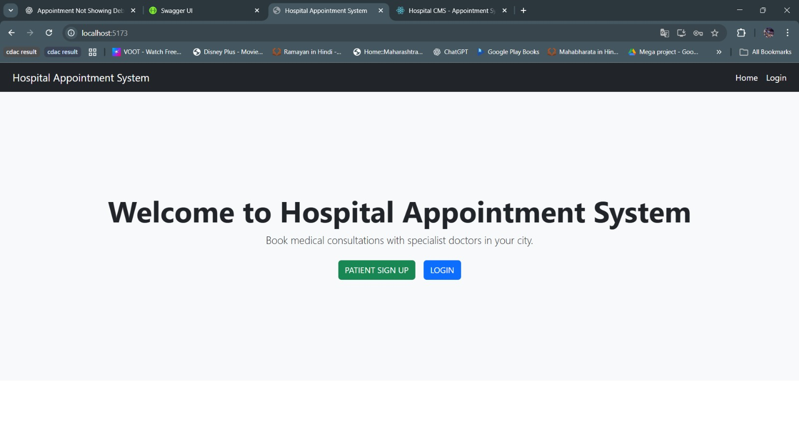

# Hospital Appointment System

## 📌 Project Overview
The Hospital Appointment System is a web-based application designed to manage hospital appointments efficiently.  
It allows patients to book appointments, doctors to manage schedules, and admins to control the system.

---

## 🚀 Features
- Patient registration and login
- Doctor and admin roles
- Appointment booking and management
- Role-based access control
- Secure authentication

---

## 🛠️ Tech Stack
**Frontend:** React, HTML, CSS, JavaScript  
**Backend:** ASP.NET Core Web API  
**Database:** SQL Server  
**Tools:** Git, GitHub

---

## 🧩 System Architecture
- React frontend communicates with backend using REST APIs
- ASP.NET Core handles business logic
- SQL Server stores application data

---

## ⚙️ Setup Instructions

### Backend
```bash
dotnet restore
dotnet run
```
## 📸 Application Screenshots


